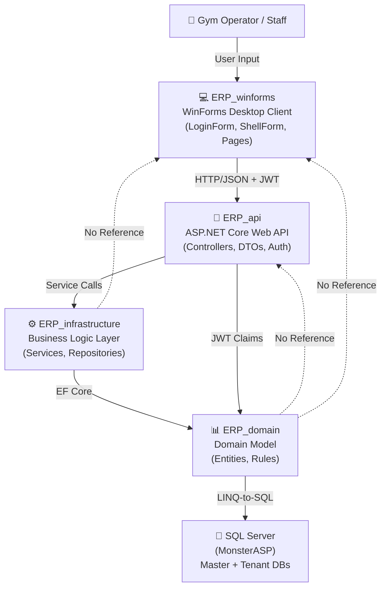
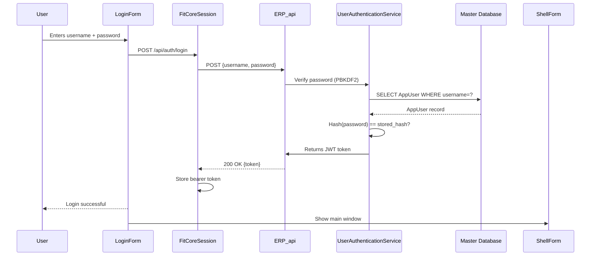
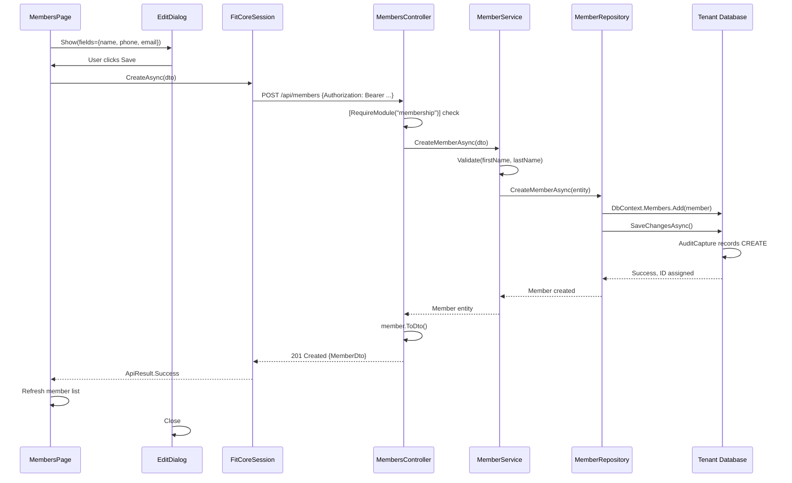
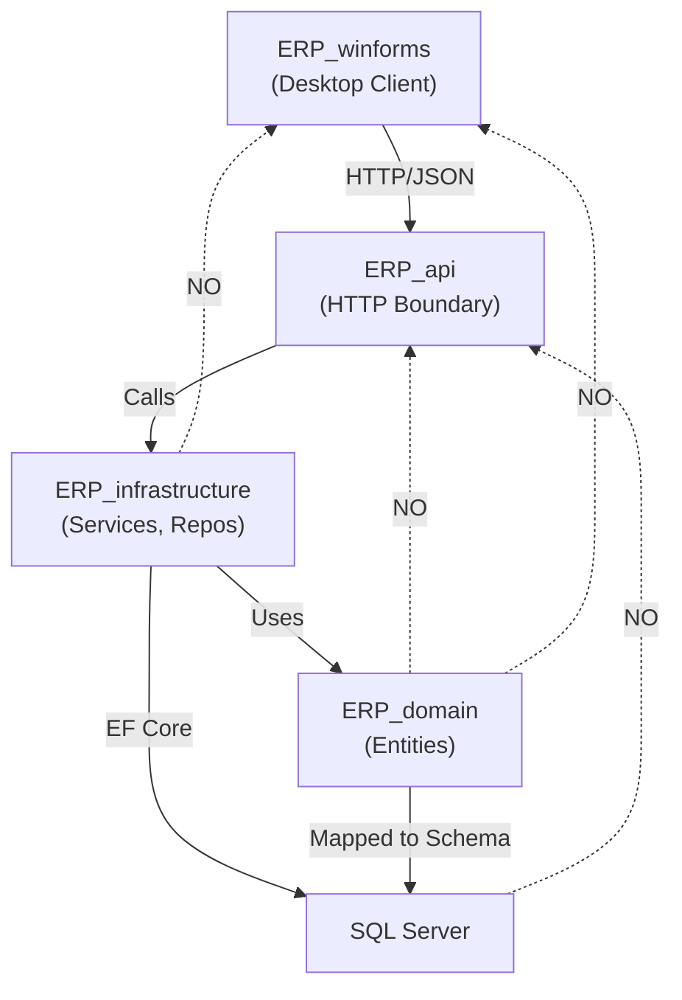
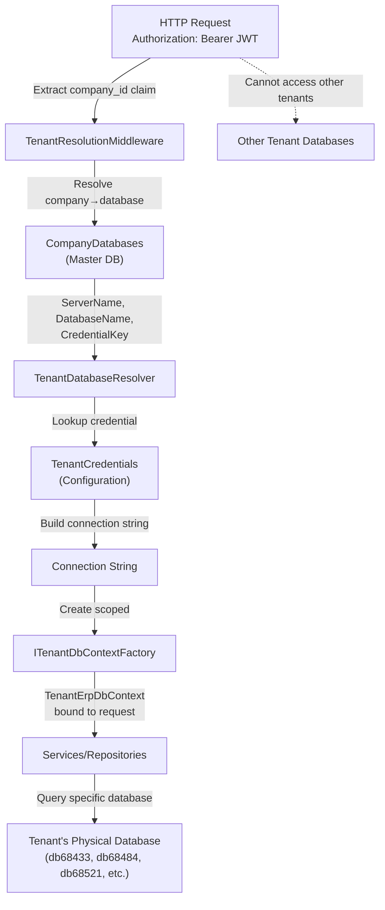

# FITCORE ERP System Architecture

## 1. System Overview

**FITCORE** is a multi-tenant SaaS ERP system designed for gym management. It comprises three physical layers:

- A **desktop client** (WinForms) for gym staff and operators to manage memberships, sales, inventory, employees, and payroll
- An **HTTP/REST API** (ASP.NET Core) that enforces business rules, tenancy isolation, and authorization
- A **SQL Server database layer** (remote, via MonsterASP hosting) with separate physical databases per tenant

The system implements the **layered architecture pattern** with clear separation of concerns: the desktop client communicates only via HTTP/JSON to the API, which owns all database access, business logic, and tenant isolation. The architecture ensures the desktop client cannot bypass API controls or directly access the database.

---

## 2. Solution Structure

```
FITCORE ERP_Project1.slnx
├── ERP_Project1/
│   ├── ERP_winforms.csproj                 [WinForms Desktop Client]
│   ├── Pages/                              [Module screens (CRUD pages)]
│   ├── Api/                                [Typed API client, DTOs, session management]
│   ├── Program.cs                          [Entry point - sign in loop]
│   ├── LoginForm.cs                        [Authentication form]
│   ├── ShellForm.cs                        [Main application shell]
│   ├── ModulePageBase.cs                   [UI frame for module screens]
│   ├── CrudPageBase<T>                     [List-and-maintain template]
│   ├── EditDialog.cs                       [Form for creating/editing records]
│   ├── UiKit.cs, UiTheme.cs                [Design system / UI components]
│   └── appsettings.json                    [API endpoint configuration]
│
├── ERP_api/
│   ├── ERP_api.csproj                      [ASP.NET Core Web API]
│   ├── Program.cs                          [Service registration, middleware pipeline]
│   ├── Controllers/                        [HTTP endpoints - thin, route to services]
│   │   ├── MembersController.cs
│   │   ├── SalesController.cs
│   │   ├── PayrollController.cs
│   │   ├── EmployeesController.cs
│   │   ├── AuthController.cs               [Sign-in, token refresh]
│   │   └── ...others...
│   ├── DTOs/                               [Request/response models]
│   │   ├── MemberDtos.cs
│   │   ├── SaleDtos.cs
│   │   ├── ApiMappings.cs                  [ToDto() projection methods]
│   │   └── ...others...
│   ├── Infrastructure/                     [API-specific middleware and handlers]
│   │   ├── ApiExceptionHandler.cs          [Converts exceptions to RFC 9457 ProblemDetails]
│   │   ├── RequireModuleAttribute.cs       [Authorization attribute]
│   │   └── ...others...
│   └── Tenancy/                            [Tenant resolution at HTTP boundary]
│       ├── TenantResolutionMiddleware.cs
│       └── ...others...
│
├── ERP_infrastructure/
│   ├── ERP_infrastructure.csproj           [EF Core, Repositories, Services]
│   ├── data/                               [DbContexts]
│   │   ├── MasterErpDbContext.cs           [Master DB: companies, users, roles]
│   │   ├── TenantErpDbContext.cs           [Tenant DB: business data]
│   │   ├── MasterErpDbContextFactory.cs
│   │   └── TenantErpDbContextFactory.cs
│   ├── repositories/                       [Data access layer]
│   │   ├── GenericRepository<T>
│   │   ├── IMemberRepository / MemberRepository.cs
│   │   ├── ISaleRepository / SaleRepository.cs
│   │   ├── IPaymentRepository / PaymentRepository.cs
│   │   ├── IPayrollRepository / PayrollRepository.cs
│   │   ├── IEmployeeRepository / EmployeeRepository.cs
│   │   └── ...others...
│   ├── services/                           [Business logic, transaction handling]
│   │   ├── IMemberService / MemberService.cs
│   │   ├── ISaleService / SaleService.cs
│   │   ├── IPaymentService / PaymentService.cs
│   │   ├── IPayrollService / PayrollService.cs
│   │   ├── IEmployeeService / EmployeeService.cs
│   │   ├── IInventoryService / InventoryService.cs
│   │   ├── IUserAuthenticationService       [Sign-in, password verification]
│   │   ├── ITenantDbContextFactory          [Request-scoped tenant resolution]
│   │   ├── ICurrentUserAccessor             [Audit trail - who is acting]
│   │   ├── PermissionResolver.cs            [Role + module resolution]
│   │   └── ...others...
│   ├── tenant/                             [Multi-tenancy infrastructure]
│   │   ├── ITenantContext.cs
│   │   ├── TenantContext.cs
│   │   ├── ITenantDatabaseResolver.cs
│   │   └── TenantDatabaseResolver.cs
│   ├── Migrations/                         [EF Core migrations for all databases]
│   └── repositories/
│
├── ERP_domain/
│   ├── ERP_domain.csproj                   [POCO entities only - no dependencies]
│   └── entities/                           [Domain model - the single source of truth]
│       ├── Member.cs
│       ├── Sale.cs, SaleItem.cs
│       ├── Payment.cs
│       ├── Subscription.cs, MembershipPlan.cs
│       ├── Employee.cs, Payroll.cs
│       ├── Product.cs, Inventory.cs, StockMovement.cs
│       ├── Supplier.cs, Customer.cs
│       ├── Company.cs, CompanyDatabase.cs  [Tenant registry]
│       ├── AppUser.cs, AppRole.cs          [Access control]
│       ├── AuditEvent.cs                   [Audit trail]
│       ├── ErpModule.cs                    [Module catalogue & tier definitions]
│       ├── Expense.cs
│       └── IAuditable.cs                   [Change tracking interface]
│
├── ERP_Tests/
│   ├── ERP_Tests.csproj                    [xUnit test suite]
│   ├── API authorization tests             [Real HTTP, JWT, token validation]
│   ├── Service tests (SQLite fixtures)     [Business logic: sales, payroll, etc.]
│   ├── Tenant resolution tests
│   ├── Audit trail tests
│   └── Connection string tests
│
└── ERP_UI/
    └── [RETIRED - Blazor WebAssembly, not part of solution]
```

---

## 3. Architecture Flow

### Overall Request/Response Flow

```
┌─────────────────────────────────────────────────────────────────┐
│                      Gym Operator / Staff                        │
└────────────────────────────┬────────────────────────────────────┘
                             │
                    [User Input]
                             │
┌────────────────────────────▼────────────────────────────────────┐
│              ERP_winforms (Desktop Client)                       │
│  • WinForms Forms/UserControls (LoginForm, ShellForm, Pages)   │
│  • ModulePageBase, CrudPageBase<T> (UI frame + behavior)       │
│  • EditDialog (field validation, user input)                    │
│  • FitCoreSession (HTTP client, bearer token holder)            │
│  • Typed API services (MemberApiService, SalesApiService, etc) │
│  • DTOs (data contracts)                                        │
│  • No EF Core, no SQL Server access, no infrastructure ref      │
└────────────────────────────┬────────────────────────────────────┘
                             │
                  [HTTPS/JSON + Bearer JWT]
                             │
┌────────────────────────────▼────────────────────────────────────┐
│                ERP_api (ASP.NET Core Web API)                   │
│                                                                  │
│  HTTP Boundary & Tenant Resolution                              │
│  ├─ TenantResolutionMiddleware                                 │
│  │  ├─ Reads company_id from JWT claim                         │
│  │  └─ Resolves connection string for this tenant              │
│  ├─ JWT Bearer authentication                                  │
│  └─ Authorization (RequireModule, role checks)                 │
│                                                                  │
│  Controllers (thin routing layer)                               │
│  ├─ MembersController → IMemberService                         │
│  ├─ SalesController → ISaleService                             │
│  ├─ PayrollController → IPayrollService                        │
│  ├─ EmployeesController → IEmployeeService                     │
│  ├─ PaymentsController → IPaymentService                       │
│  ├─ AuthController → IUserAuthenticationService                │
│  └─ ...others...                                               │
│                                                                  │
│  DTOs (MemberDto, SaleDto, etc.)                                │
│  └─ ApiMappings.cs (entity → DTO projections)                  │
│                                                                  │
│  Exception Handler                                              │
│  └─ ApiExceptionHandler (converts to RFC 9457 ProblemDetails)  │
└────────────────────────────┬────────────────────────────────────┘
                             │
                  [Repository / Service calls]
                             │
┌────────────────────────────▼────────────────────────────────────┐
│          ERP_infrastructure (Business Logic Layer)               │
│                                                                  │
│  Services (business rules, transactions)                        │
│  ├─ MemberService (member CRUD, archive/restore)              │
│  ├─ SaleService (sale creation, stock deduction, rollback)    │
│  ├─ PaymentService (payment create/update)                    │
│  ├─ PayrollService (payroll calculation, overlap checks)      │
│  ├─ EmployeeService (employee records)                        │
│  ├─ UserAuthenticationService (sign-in, PBKDF2)              │
│  ├─ PermissionResolver (role + module resolution)             │
│  └─ ...others...                                               │
│                                                                  │
│  Repositories (data access)                                     │
│  ├─ GenericRepository<T> (base CRUD)                           │
│  ├─ MemberRepository (specialized queries)                     │
│  ├─ SaleRepository                                             │
│  ├─ PaymentRepository                                          │
│  ├─ PayrollRepository                                          │
│  └─ ...others...                                               │
│                                                                  │
│  DbContexts                                                     │
│  ├─ TenantErpDbContext (DbSet<Member>, DbSet<Sale>, etc.)     │
│  └─ MasterErpDbContext (DbSet<Company>, DbSet<AppUser>, etc.) │
│                                                                  │
│  Tenancy & Context Factories                                    │
│  ├─ ITenantDbContextFactory (scoped to request)               │
│  ├─ TenantDatabaseResolver (registry → connection string)     │
│  └─ ICurrentUserAccessor (audit trail attribution)            │
└────────────────────────────┬────────────────────────────────────┘
                             │
                  [EF Core LINQ-to-SQL]
                             │
┌────────────────────────────▼────────────────────────────────────┐
│                ERP_domain (Data Model)                           │
│                                                                  │
│  Entities (POCO, no framework dependencies)                     │
│  ├─ Member, Subscription, MembershipPlan                       │
│  ├─ Sale, SaleItem, Payment                                    │
│  ├─ Employee, Payroll                                          │
│  ├─ Product, Inventory, StockMovement                          │
│  ├─ Customer, Supplier, Expense                                │
│  ├─ AuditEvent (audit trail records)                           │
│  ├─ Company (tenant registry)                                  │
│  ├─ AppUser, AppRole (access control)                          │
│  └─ ErpModule (module catalogue, tier definitions)             │
│                                                                  │
│  No dependencies (pure C#, no EF, no ASP.NET Core)              │
└────────────────────────────┬────────────────────────────────────┘
                             │
                 [SQL Server (Remote)]
                             │
┌────────────────────────────▼────────────────────────────────────┐
│              SQL Server Databases (MonsterASP)                   │
│                                                                  │
│  Master Database (One per platform)                             │
│  ├─ Companies, CompanyDatabases (tenant registry)              │
│  ├─ AppUsers, AppRoles, AppRolePermissions                     │
│  ├─ AppUserPermissions (per-user overrides)                    │
│  ├─ Devices (session management)                               │
│  ├─ AuditEvents (platform-level: sign-in, permission changes) │
│  └─ AspNetCore Identity tables                                 │
│                                                                  │
│  Tenant Databases (One per company)                             │
│  ├─ Members, Subscriptions, MembershipPlans                    │
│  ├─ Sales, SaleItems, Payments                                 │
│  ├─ Employees, Payrolls                                        │
│  ├─ Products, Inventories, StockMovements                      │
│  ├─ Customers, Suppliers, Expenses                             │
│  └─ AuditEvents (business-level: member, sale, payroll)        │
└─────────────────────────────────────────────────────────────────┘
```

### Data Flow for a Typical Request (Create Member Example)

```
1. WinForms: User fills EditDialog with member name, phone, email
2. WinForms: Dialog validates input (required fields, email format, max length)
3. WinForms: User clicks "Save"
4. WinForms: EditDialog calls Session.Members.CreateAsync(dto)
5. WinForms: FitCoreSession sends HTTP POST to /api/members with bearer token
6. ERP_api: TenantResolutionMiddleware reads company_id from JWT claim
7. ERP_api: Resolves company_id → CompanyDatabases row → connection string
8. ERP_api: MembersController.Post() receives request
9. ERP_api: RequireModule("membership") checks JWT claims → 403 if missing
10. ERP_api: Controller calls IMemberService.CreateMemberAsync(dto)
11. Infrastructure: MemberService validates business rules
12. Infrastructure: Creates Member entity
13. Infrastructure: TenantErpDbContext.Members.Add(member)
14. Infrastructure: Saves to tenant's physical database
15. Infrastructure: AuditCapture automatically records the CREATE
16. ERP_api: Controller returns 201 Created with MemberDto
17. WinForms: Receives 201 response, shows "Member created successfully"
18. WinForms: Refreshes the member list from the API
```

### Key Design Principles Enforced

1. **Desktop client as pure HTTP consumer:**
   - No project references to infrastructure or domain
   - No DbContext, repositories, or services
   - Only uses `FitCoreSession` (HTTP client) and DTOs
   - Cannot bypass API controls

2. **API owns all business logic:**
   - Controllers route to services
   - Services validate and enforce business rules
   - Controllers return DTOs, never entities
   - Authorization checked at controller level (RequireModule attribute)

3. **Infrastructure isolated from HTTP:**
   - No ASP.NET Core dependencies (no HttpContext, no Controllers)
   - Services are framework-agnostic
   - Repositories are framework-agnostic
   - DbContexts only know about entities and EF Core

4. **Domain as pure data model:**
   - Entities are POCOs (no framework)
   - No navigation properties with behavior
   - No database logic
   - Single source of truth for the business model

5. **Tenancy at the HTTP boundary:**
   - Company claim extracted from JWT
   - Middleware resolves to connection string before business logic runs
   - Scoped ITenantDbContextFactory binds DbContext to request
   - Repositories/services never see multitenancy—they see one database

---

## 4. Project Responsibilities

### ERP_domain (POCO Entities)

**Purpose:** Define the business domain in pure C#. The single source of truth for the data model.

**Important Folders:**
- `entities/` — All domain model classes

**Important Classes:**
- `Member`, `Subscription`, `MembershipPlan` — Membership module
- `Sale`, `SaleItem`, `Payment` — Sales & payments
- `Product`, `Inventory`, `StockMovement` — Inventory management
- `Employee`, `Payroll` — Workforce & payroll
- `Customer`, `Supplier`, `Expense` — Directory & expenses
- `Company`, `CompanyDatabase` — Tenant registry (master DB)
- `AppUser`, `AppRole`, `AppRolePermission`, `AppUserPermission` — Access control
- `AuditEvent` — Audit trail
- `ErpModule` — Module catalogue and tier definitions
- `IAuditable` — Change tracking interface

**Dependencies:**
- None. No NuGet packages, no framework references.

**Access Rules:**
- ✅ Referenced by: ERP_infrastructure, ERP_api, ERP_Tests
- ❌ References: Nothing (pure domain model)

**What It Must NOT Do:**
- No database access (no EF Core)
- No HTTP (no ASP.NET Core)
- No UI concerns (no WinForms)
- No framework-specific attributes (all attributes are domain-level or EF Core data annotations)

---

### ERP_infrastructure (EF Core, Repositories, Services)

**Purpose:** Implement data persistence, business logic, and tenancy.

**Important Folders:**
- `data/` — DbContexts, EF Core configuration, design-time factories
- `repositories/` — Repository pattern for data access
- `services/` — Business logic, validation, transactions
- `tenant/` — Multi-tenancy: context factories, tenant resolution

**Important Classes:**

**Data Layer:**
- `MasterErpDbContext` — Master database (companies, users, roles)
- `TenantErpDbContext` — Tenant database (business data)
- `TenantErpDbContextFactory` — Scoped factory resolving the current tenant's context
- `AuditCapture` — Automatic change tracking

**Repositories:**
- `GenericRepository<T>` — Base CRUD operations
- `MemberRepository`, `SaleRepository`, `PaymentRepository`, etc. — Specialized queries

**Services:**
- `MemberService` — Member CRUD, archive/restore
- `SaleService` — Sale creation, stock check, rollback
- `PaymentService` — Payment create/update
- `PayrollService` — Payroll calculation, overlap detection
- `EmployeeService` — Employee records
- `InventoryService` — Stock tracking and movements
- `UserAuthenticationService` — Sign-in, password verification (PBKDF2)
- `PermissionResolver` — Role + module resolution + tier enforcement
- `ICurrentUserAccessor` — Audit trail attribution (who acted)
- `TenantDatabaseResolver` — Registry lookup: company → connection string

**Dependencies:**
- `ERP_domain` (entities)
- EF Core NuGet packages (SqlServer, Design, Tools, Identity)
- Microsoft.Extensions (config, options)

**Access Rules:**
- ✅ Referenced by: ERP_api, ERP_Tests
- ✅ References: ERP_domain, EF Core, Microsoft.Extensions
- ❌ References: No ASP.NET Core, no HTTP, no WinForms

**What It Must NOT Do:**
- No HTTP/Controller logic (that is ERP_api's job)
- No UI (that is ERP_winforms's job)
- No ASP.NET Core references (framework-agnostic)

---

### ERP_api (ASP.NET Core Web API)

**Purpose:** HTTP/REST boundary. Route requests to services, enforce authorization, return DTOs.

**Important Folders:**
- `Controllers/` — HTTP endpoints
- `DTOs/` — Request/response models
- `Infrastructure/` — API-specific: exception handler, middleware, attributes
- `Tenancy/` — Tenant resolution at HTTP boundary

**Important Classes:**

**Controllers:**
- `MembersController`, `SalesController`, `PaymentController`, etc. — HTTP endpoints (thin layer)
- `AuthController` — Sign-in, token refresh, password change

**DTOs:**
- `MemberDto`, `SaleDto`, `PaymentDto`, etc. — Request/response contracts
- `ApiMappings.cs` — Extension methods: `entity.ToDto()`

**Infrastructure:**
- `TenantResolutionMiddleware` — Extract company from JWT, resolve connection string
- `ApiExceptionHandler` — Convert exceptions to RFC 9457 ProblemDetails
- `RequireModuleAttribute` — Authorization filter
- `HttpCurrentUserAccessor` — Implement ICurrentUserAccessor for audit trail

**Dependencies:**
- `ERP_domain` (entities)
- `ERP_infrastructure` (services, repositories, DbContexts)
- ASP.NET Core NuGet packages (Mvc, Authentication, Identity)
- JWT Bearer authentication

**Access Rules:**
- ✅ Referenced by: ERP_Tests
- ✅ References: ERP_domain, ERP_infrastructure, ASP.NET Core
- ❌ References: No WinForms

**What It Must NOT Do:**
- No repository.GetAll() directly in controllers (route through services)
- No business logic in controllers (that is ERP_infrastructure's job)
- No direct database access (that is ERP_infrastructure's job)
- No DTOs returned as entities (must map)

---

### ERP_winforms (Desktop Client)

**Purpose:** User-facing desktop application. Pure HTTP consumer.

**Important Folders:**
- `Pages/` — Module screens (derive from CrudPageBase or ModulePageBase)
- `Api/` — Typed API client, DTOs, FitCoreSession

**Important Classes:**

**Forms:**
- `Program.cs` — Entry point: sign-in loop
- `LoginForm` — Sign-in screen (posts to /api/auth/login)
- `ShellForm` — Main application shell: sidebar, topbar, navigation
- `ModuleWorkspace` — A module and its tabs

**Base Classes (for all screens):**
- `ModulePageBase` — Frame: title, toolbar, filters, status, loading/empty states
- `CrudPageBase<T>` — List-and-maintain: grid + Add/Edit/Delete buttons
- `EditDialog` — Form builder with client-side validation (required, email, length, etc.)

**UI System:**
- `UiTheme` — Design tokens (colors, fonts, spacing)
- `UiKit` — Control factory and helpers

**API Client:**
- `FitCoreSession` — HttpClient holder, bearer token manager, connection retry
- `MemberApiService`, `SalesApiService`, etc. — Typed wrappers around HTTP endpoints
- DTOs (duplicated from ERP_api for complete independence)

**Dependencies:**
- `Microsoft.Extensions.Configuration*` only
- System.Net.Http (built-in)
- No EF Core, no infrastructure, no domain

**Access Rules:**
- ✅ References: Configuration packages only
- ❌ References: Nothing else (no ERP_domain, no ERP_infrastructure, not even for viewing)

**What It Must NOT Do:**
- No DbContext (cannot access database directly)
- No repositories or services (those are on the server)
- No connection strings (the API owns that)
- No EF Core (the API owns the schema)
- No business logic (validated by the API, not the client)

---

### ERP_Tests (xUnit Test Suite)

**Purpose:** Automated tests for authorization, business logic, tenancy, and audit trail.

**Test Categories:**

1. **Authorization Tests** (`ApiAuthorizationTests.cs`)
   - Real HTTP against the API
   - Anonymous calls rejected everywhere but sign-in
   - Micro tier denied modules above its level
   - Small tier reaches Employees/Payroll but not User Access
   - Staff reaches only front-desk modules
   - Expired tokens rejected
   - Wrong signing key rejected

2. **Service Tests** (SQLite fixtures)
   - Member delete guards (members with payments/sales cannot be deleted)
   - Sale transactions (price from catalogue, stock deduction, rollback on cancel)
   - Payroll overlap detection
   - Stock arithmetic (balance before/after)
   - Subscription renewal from existing end date

3. **Tenant Resolution Tests**
   - JWT claim beats header
   - Header ignored outside Development
   - Missing tenant resolved correctly

4. **Audit Trail Tests**
   - Changes attributed correctly
   - Password hashes never recorded
   - Only changed properties recorded on update

5. **Connection String Tests**
   - Registry lookup
   - Fallback behavior
   - TCP prefix handling
   - Credentials with special characters

**Dependencies:**
- ERP_domain, ERP_infrastructure, ERP_api
- xUnit, Microsoft.AspNetCore.Mvc.Testing, SQLite fixtures

**Access Rules:**
- ✅ References: All three projects (for comprehensive testing)
- ❌ References: NOT ERP_winforms (it is tested indirectly through the API)

---

## 5. Project Reference Dependency Diagram

```
                    ERP_domain
                        ▲
                        │
        ┌───────────────┼───────────────┐
        │               │               │
        │               │               │
   ERP_infra       ERP_api         ERP_Tests
        │               │               │
        ├───────────────┴───────────────┘
        │
        │
        ▲
        │
   [Database]
   SQL Server
   (remote)

ERP_winforms (desktop client)
        ├─ HTTP/JSON requests only
        └─ NO project references
            (only Config packages)
            │
            ▼
        ERP_api (HTTP boundary)
```

**Detailed Reference Map:**

| Project | References | Referenced By |
|---------|-----------|---------------|
| ERP_domain | (none) | ERP_infrastructure, ERP_api, ERP_Tests |
| ERP_infrastructure | ERP_domain | ERP_api, ERP_Tests |
| ERP_api | ERP_domain, ERP_infrastructure | ERP_Tests |
| ERP_winforms | (none - only Config packages) | (standalone) |
| ERP_Tests | ERP_domain, ERP_infrastructure, ERP_api | (testing only) |
| ERP_UI | (retired, not in solution) | — |

**Key Constraint:** ERP_winforms has **zero project references**. It communicates with ERP_api exclusively through HTTP.

---

## 6. API Architecture

### Endpoints & Routing

The API follows RESTful conventions and is organized by domain module:

| Module | Endpoints | Authentication | Authorization |
|--------|-----------|-----------------|---------------|
| **Members** | `GET/POST /api/members`, `/search`, `/{id}`, `/archive`, `/restore` | JWT Bearer | RequireModule("membership") |
| **Membership Plans** | `GET/POST /api/membership-plans`, `/active`, `/{id}` | JWT Bearer | RequireModule("membership") |
| **Subscriptions** | `GET/POST /api/subscriptions`, `/{id}/renew`, `/cancel`, `/expire-overdue` | JWT Bearer | RequireModule("membership") |
| **Sales** | `GET/POST /api/sales`, `/{id}`, `/{id}/items` | JWT Bearer | RequireModule("sales") |
| **Products** | `GET/POST /api/products`, `/active`, `/{id}` | JWT Bearer | RequireModule("inventory") |
| **Inventory** | `GET /api/inventory`, `/movements`, `/{id}`, `/{id}/stock-in`, `/stock-out`, `/adjust` | JWT Bearer | RequireModule("inventory") |
| **Payments** | `GET/POST /api/payments`, `/{id}`, `/status` | JWT Bearer | RequireModule("payments") |
| **Employees** | `GET/POST /api/employees`, `/active`, `/search`, `/{id}` | JWT Bearer | RequireModule("employees") |
| **Payroll** | `GET/POST /api/payroll`, `/{id}`, `/status` | JWT Bearer | RequireModule("payroll") |
| **Customers** | `GET/POST /api/customers`, `/{id}` | JWT Bearer | RequireModule("sales") |
| **Suppliers** | `GET/POST /api/suppliers`, `/{id}` | JWT Bearer | RequireModule("inventory") |
| **Reports** | `GET /api/reports/dashboard`, `/membership-overview` | JWT Bearer | RequireModule("reports") |
| **Authentication** | `POST /api/auth/login` (anonymous), `/me`, `/refresh`, `/change-password`, `/logout` | JWT Bearer (except login) | — |

### Request/Response Flow

```
1. Client (WinForms) sends HTTP request with Authorization: Bearer <token>

2. ASP.NET Core Pipeline:
   ├─ JwtBearerHandler (middleware)
   │  └─ Validates JWT signature, expiry, issuer, audience
   │     └─ Sets HttpContext.User with claims
   │
   ├─ TenantResolutionMiddleware
   │  ├─ Reads company_id claim from JWT
   │  ├─ ITenantDatabaseResolver.Resolve(companyId)
   │     └─ CompanyDatabases registry lookup
   │        └─ Returns ServerName, DatabaseName, CredentialKey
   │  └─ Creates scoped ITenantContext with connection string
   │
   ├─ Routing to Controller
   │
   └─ MembersController (example)
      ├─ [Authorize] attribute validates user is authenticated
      ├─ [RequireModule("membership")] attribute checks JWT claims
      │  └─ Throws 403 Forbidden if module missing
      │
      ├─ Method executes
      │  ├─ Calls IMemberService through constructor injection
      │  │  └─ Service gets TenantErpDbContext (bound to this request's tenant)
      │  └─ Receives List<Member>
      │
      ├─ Maps entities to DTOs
      │  └─ member.ToDto() in ApiMappings
      │
      └─ Returns response (200 OK, 400 Bad Request, 403 Forbidden, 404 Not Found, 409 Conflict, 500 Server Error)

3. ApiExceptionHandler catches unhandled exceptions
   ├─ Maps ValidationException → 400
   ├─ Maps ForbiddenOperationException → 409 Conflict
   ├─ Maps DbUpdateException → 500 with scrubbed message
   └─ Returns RFC 9457 ProblemDetails JSON
      {
        "type": "https://...",
        "title": "Bad Request",
        "detail": "This member has subscriptions, payments or sales...",
        "status": 400
      }

4. Response sent to client

5. FitCoreSession (in WinForms)
   ├─ Checks response status
   ├─ On 401: raises SessionExpired event → shell returns to login
   ├─ On 403: user lacks permission
   ├─ On 4xx/5xx: calls ApiErrorText to format error message
   └─ Shows to user or returns to caller
```

### DTOs (Request/Response Models)

DTOs are intentionally **duplicated** between `ERP_api/DTOs` and `ERP_Project1/Api`:

**ERP_api/DTOs** (server-side):
- Used by controllers for request/response serialization
- Validated by `[DataAnnotations]` attributes
- Mapped from/to domain entities

**ERP_Project1/Api** (client-side):
- Identical structure to server DTOs
- Used by WinForms pages and dialogs
- Ensures the desktop client is completely independent

This duplication is deliberate: WinForms must never reference ERP_api, so the contracts cannot be shared.

### Error Handling

**ApiExceptionHandler** converts unhandled exceptions to user-facing messages:

```csharp
ValidationException          → 400 Bad Request     ("First name is required.")
ForbiddenOperationException  → 409 Conflict       ("Member has subscriptions, cannot delete")
DbUpdateException            → 500 Server Error    (generic, no SQL details)
Unauthorized (401)           → 401 Unauthorized    (expired/invalid token)
403 Forbidden                → 403 Forbidden       (missing module permission)
404 Not Found                → 404 Not Found       (record does not exist)
```

**Scrubbing Rule:** Any message that looks like a connection string, stack trace, or credential is replaced with a generic message and logged server-side only.

---

## 7. Database Architecture

### Overall Structure

```
SQL Server (MonsterASP hosting)
├── Master Database (one per platform)
│   ├── Companies
│   ├── CompanyDatabases (tenant registry)
│   ├── AppUsers, AppRoles, AppRolePermissions, AppUserPermissions
│   ├── Devices (session management)
│   └── AuditEvents
│
└── Tenant Databases (one per company)
    ├── Members, Subscriptions, MembershipPlans
    ├── Sales, SaleItems, Payments
    ├── Employees, Payrolls
    ├── Products, Inventories, StockMovements
    ├── Customers, Suppliers, Expenses
    └── AuditEvents
```

### DbContexts

**MasterErpDbContext** (multi-tenant platform management):
- `Companies` — Tenant registry, tier level
- `CompanyDatabases` — Tenant → connection string mapping
- `Devices` — Session/device tracking
- `AppUsers`, `AppRoles` — Access control
- `AppRolePermissions`, `AppUserPermissions` — Module permissions per role/user
- `AuditEvents` — Platform-level audit trail (sign-in, permission changes)

**TenantErpDbContext** (tenant's business data):
- `Members`, `Subscriptions`, `MembershipPlans` — Membership module
- `Sales`, `SaleItems`, `Payments` — Sales & payments
- `Products`, `Inventories`, `StockMovements` — Inventory
- `Employees`, `Payrolls` — Workforce
- `Customers`, `Suppliers`, `Expenses` — Directory & costs
- `AuditEvents` — Tenant's business-level audit trail

### Request-Scoped Tenant Binding

```
HTTP Request arrives with JWT
        ↓
TenantResolutionMiddleware
├─ Extract company_id from JWT claim
├─ ITenantDatabaseResolver.Resolve(companyId)
│  └─ Queries master DB: CompanyDatabases[companyId]
│     └─ Returns: ServerName, DatabaseName, CredentialKey
│
├─ ICredentialProvider.GetPassword(CredentialKey)
│  └─ Looks up TenantCredentials:CredentialKey in config
│     └─ Returns password
│
├─ Builds connection string with SqlConnectionStringBuilder
│  └─ "Server=tcp:...;Database=...;User Id=...;Password=..."
│
└─ Creates scoped ITenantContext(connectionString)
        ↓
Service/Repository runs
├─ Constructor injects ITenantDbContextFactory
├─ Factory.CreateForCurrentTenant()
│  └─ Returns TenantErpDbContext bound to this request's tenant
│
└─ DbContext uses the connection string → queries the correct database
```

### Migrations

EF Core migrations are managed per DbContext:

```powershell
# Master database
dotnet ef database update --context MasterErpDbContext `
    --project ERP_infrastructure --startup-project ERP_api

# Tenant database (TenantErp connection string, which points to db68433)
dotnet ef database update --context TenantErpDbContext `
    --project ERP_infrastructure --startup-project ERP_api

# Override to apply to a different tenant database
$env:TENANT_ERP_CONNECTION_NAME = "TenantErpB"  # or "TenantErpC"
dotnet ef database update ...
```

### Data Isolation

- **Physical:** Each tenant's data lives in a separate SQL Server database
- **Logical:** The connection string resolves at request time, so a Micro tenant's DbContext is literally connected to `db68433`, a Small tenant to `db68484`, etc.
- **Access Control:** JWT company claim is the only thing that determines which database is reached. A request cannot cross tenants unless the token claims it.

### Monetary Precision

All monetary columns are declared with `HasPrecision(18, 2)`:

```csharp
public decimal Amount { get; set; }  // decimal, no float/double
```

This ensures exact currency calculations without floating-point rounding errors.

### Audit Trail

**Automatic capture** via `AuditCapture` in `SaveChanges()`:
- Tracks CREATE, UPDATE, DELETE operations
- Records only changed properties on UPDATE
- Excludes UpdatedAt, CreatedAt, LastLoginAt, password hashes
- Attributes actions to `ICurrentUserAccessor.CurrentUser` (HTTP context) or system (design-time, tests)

**Named actions** (explicit):
- `Login`, `PayrollPaid`, `StockAdjusted`, etc.
- Services raise these when the change-tracker doesn't capture the business event

Both types end up in `AuditEvent` (master and/or tenant databases).

---

## 8. Domain Architecture

The domain layer (`ERP_domain`) defines the business model in pure C#.

### Core Entities

**Membership Module:**
- `Member` — A person who trains
- `MembershipPlan` — Subscription tiers (e.g., "Gold", "Premium")
- `Subscription` — Active member subscription to a plan, with start/end date

**Sales & Payments:**
- `Sale` — A transaction: products sold to a member
- `SaleItem` — One line on a sale (product + qty + price)
- `Payment` — Money in (payment method, amount, date)

**Inventory:**
- `Product` — Merchandise (protein powder, gym bags, etc.)
- `Inventory` — On-hand quantity per product
- `StockMovement` — Audit trail of stock changes (qty before/after)

**Workforce:**
- `Employee` — Staff member (name, position, salary, etc.)
- `Payroll` — Pay run (employee, period, amount, status)

**Directory:**
- `Customer` — Person who buys products
- `Supplier` — Vendor of products

**Costs:**
- `Expense` — Business expense (rent, utilities, etc.)

**Access Control:**
- `Company` — Tenant (name, tier level, enabled/disabled)
- `AppUser` — Login account (username, email, password hash)
- `AppRole` — Role template (Admin, Manager, Staff, etc.)
- `AppRolePermission` — Role → module mapping
- `AppUserPermission` — Per-user overrides (grant/withhold module)

**Audit & System:**
- `AuditEvent` — Timestamped record of who changed what
- `CompanyDatabase` — Maps company → server/database/credentials
- `Device` — Session/device tracker
- `ErpModule` — Module catalogue (defines tier levels and available features)

### Business Rules (Enforced in Services)

1. **Member Delete Guard:** Cannot delete a member with subscriptions, payments, or sales (archive instead)
2. **Sale Transaction:** Prices from catalogue, not client; stock checked; duplicate lines merged; atomicity
3. **Payroll Overlap:** No two runs for the same employee on overlapping date ranges
4. **Stock Movement:** All stock changes record balance before/after
5. **Subscription Renewal:** Extends from existing end date if still in future
6. **Tier Ceiling:** Permissions cannot exceed the company's tier (Micro < Small < Medium)

### Design Principles

- **No behavior in entities:** Entities are data containers only
- **No framework dependencies:** Pure C# POCO classes
- **No database concerns:** No navigation properties with lazy loading
- **Single source of truth:** Entities define the schema, migrations flow from entities
- **Immutable contracts:** Adding a field to an entity requires a migration

---

## 9. UI Architecture

The WinForms desktop client is the only user-facing application.

### Form Hierarchy

```
Program
├─ LoginForm (sign-in screen)
│
└─ ShellForm (main application shell)
   ├─ Sidebar (module navigation)
   │  └─ NavButton per module (Members, Sales, Inventory, etc.)
   │
   └─ Content panel (hosts workspaces)
      └─ ModuleWorkspace (for selected module)
         ├─ Tab strip (submodules)
         │  ├─ MembersPage (CrudPageBase<MemberDto>)
         │  ├─ MembershipPlansPage (CrudPageBase<MembershipPlanDto>)
         │  ├─ SubscriptionsPage (CrudPageBase<SubscriptionDto>)
         │  └─ ...others...
         │
         └─ EditDialog (modal form for create/edit)
            ├─ Dynamic field layout based on FieldSpec[]
            ├─ Client-side validation (required, email, length, custom)
            └─ Save callback (calls API, returns error message or null on success)
```

### Page Types

**CrudPageBase<T>** — List-and-maintain (most common):
- Grid displaying records
- Add button → EditDialog
- Edit button (double-click grid or Edit button) → EditDialog
- Delete button → confirmation dialog
- Search/filter textbox
- Status line showing success/error
- Empty state when no records
- Loading overlay

**ModulePageBase** — Base frame for all screens:
- Title, subtitle
- Toolbar (action buttons)
- Filter bar (search, dropdowns, etc.)
- Grid or custom body content
- Status line
- Loading/empty/error states
- Shared look and feel

**Specialized Pages:**
- `DashboardPage` — Statistics and quick actions
- `PaymentsAndReports` — Payment grid + reports
- `InventoryPages` — Stock movements + adjustment forms
- `WorkforcePages` — Employee + Payroll pages

### Module Structure

The sidebar lists **modules**; each module opens a workspace with **tabs** (submodules):

```
MAIN
├─ Dashboard
OPERATIONS
├─ Membership (tabs: Members, Plans, Subscriptions)
├─ Payments (tabs: Payment Transactions)
├─ Sales (tabs: New Sale, Sales History, Customers)
├─ Inventory (tabs: Products, Stock, Suppliers)
├─ Employees (tabs: Employee Records) — Small/Medium only
├─ Payroll (tabs: Payroll Records) — Small/Medium only
INSIGHT
├─ Reports
ACCOUNT
├─ Change Password
├─ Sign Out
```

Whether a module appears is determined by the user's tier and role, evaluated server-side in `PermissionResolver` and embedded in the JWT.

### Session & Authentication

**FitCoreSession** is the single HTTP client for the entire application:

```csharp
public sealed class FitCoreSession : IApiFailureSink
{
    private readonly HttpClient _http;
    public string? BearerToken { get; set; }  // Set by LoginForm after /api/auth/login
    
    // Typed API clients (each injected into pages)
    public MemberApiService Members { get; private set; }
    public SalesApiService Sales { get; private set; }
    // ... etc
    
    // Every API call includes the bearer token in Authorization header
}
```

**LoginForm:**
- Prompts for username/email and password
- Posts to `POST /api/auth/login` (anonymous, no token)
- Server validates credentials (PBKDF2) and returns JWT
- Session stores token
- ShellForm opens (signed in)

**Token Expiry:**
- Every page load calls `GET /api/auth/me` to validate token
- If 401, ShellForm returns DialogResult.Retry → Program restarts the login loop
- User signs in again

### Validation

**Client-side** (EditDialog):
- Required fields
- Email format
- Whole numbers vs decimals
- Max length (mirrors server schema)
- Custom rules per field

**Server-side** (API, always):
- Full validation
- Business rules (member delete guard, payroll overlap, etc.)
- Authorization (user has module permission)

Client validation is a courtesy; server validation is the enforcer.

---

## 10. MVC Architecture Audit

### What is MVC?

**Model-View-Controller** is an architectural pattern separating concerns:

- **Model:** The domain, business logic, and data representation
- **View:** The presentation layer that displays data to the user
- **Controller:** The handler that receives user input, invokes model logic, and updates the view

For a **WinForms desktop application** (not ASP.NET MVC):

- **Model** → domain entities, services, repositories (business logic)
- **View** → WinForms Forms, UserControls, dialogs (UI presentation)
- **Controller** → form event handlers and page logic (receives input, calls model, updates UI)

This project does not follow traditional ASP.NET MVC (no Razor Views). Instead, it uses a **layered + domain-driven design** with clear separation.

### Actual Implementation

#### **Model Layer** ✅

**Domain Entities** (ERP_domain):
- `Member`, `Sale`, `Payment`, `Employee`, `Payroll`, etc.
- Pure C# POCOs, no framework

**Services** (ERP_infrastructure):
- `MemberService`, `SaleService`, `PaymentService`, etc.
- Business logic: validation, calculations, transactions
- Repositories injected in
- Framework-agnostic (no HTTP, no UI)

**Repositories** (ERP_infrastructure):
- `IMemberRepository`, `ISaleRepository`, etc.
- Data access abstraction
- Queries, not commands in many cases

**In the API Layer** (ERP_api):
- Controllers call services (not repositories directly)
- Services return entities
- Controllers map entities → DTOs
- DTOs returned to client

**In the Desktop Layer** (ERP_winforms):
- DTOs received from API
- Displayed in grids/dialogs
- No direct access to domain entities or services

---

#### **View Layer** ✅

**WinForms Forms & UserControls:**
- `LoginForm` — Authentication UI
- `ShellForm` — Main application shell
- `ModuleWorkspace` — A module and its tabs
- `MembersPage`, `SalesPage`, etc. (derived from CrudPageBase or ModulePageBase)
- `EditDialog` — Form for creating/editing records
- `ListDialog` — Read-only detail grids

**Design System:**
- `UiTheme` — Design tokens (colors, fonts, spacing)
- `UiKit` — Control factory (buttons, textboxes, grids)

**Key Design:**
- Views are dumb: they call services (e.g., `Session.Members.CreateAsync()`) but do not process results
- Views do not contain business logic (server validates, client is just a conduit)
- Views use data binding through public properties (grid.DataSource = items)
- Dialogs capture user input and pass to API callbacks

---

#### **Controller Layer** ✅

**In the API Layer** (ERP_api/Controllers):
- `MembersController.Post()` — Receives HTTP request
- Routes to `IMemberService.CreateMemberAsync(dto)`
- Maps result to `MemberDto`
- Returns HTTP response

**Pattern:** Controller is thin—route to service, map to DTO, return.

**In the Desktop Layer** (ERP_winforms):
- Page class (e.g., `MembersPage`) inherits from `CrudPageBase<T>`
- Overrides abstract methods: `FetchAsync()`, `DefineColumns()`, `OnAddAsync()`, etc.
- `FetchAsync()` calls `Session.Members.GetAllAsync()` (typed API client)
- `OnAddAsync()` shows dialog, calls `Session.Members.CreateAsync(dto)` in callback
- Grid selection triggers `EditClicked()` → shows dialog with existing values
- Error/success handled by showing messages

**Pattern:** Page logic is the controller—receives click events, invokes API, updates grid.

---

### MVC Pass/Fail Analysis

| Component | Actual Implementation | Status | Evidence |
|-----------|----------------------|--------|----------|
| **Model** | Domain entities (ERP_domain) + Services (ERP_infrastructure) + Repositories | ✅ PASS | MemberService, SaleService contain business logic; entities are POCOs; no UI concerns |
| **View** | WinForms Forms/UserControls (LoginForm, ModulePageBase, CrudPageBase, EditDialog) | ✅ PASS | Forms display data; EditDialog captures input; no business logic in UI |
| **Controller (API)** | ASP.NET Core Controllers routing to services | ✅ PASS | MembersController, SalesController are thin; call services; return DTOs |
| **Controller (UI)** | Page classes receiving click events, calling API, updating UI | ✅ PASS | MembersPage.AddClicked() → EditDialog → Session.Members.CreateAsync() → Refresh() |
| **Separation of Concerns** | Model isolated, View isolated, Controller isolated; clear dependencies | ✅ PASS | No database access in UI; no HTTP in infrastructure; no business logic in controllers |

### MVC PASS/FAIL SUMMARY

**MVC Architecture: ✅ PASS**

The project **does follow MVC principles**, though not in traditional ASP.NET MVC style:

1. **Model** is properly separated:
   - Domain entities are POCOs
   - Services contain business logic
   - Repositories abstract data access
   - Infrastructure is framework-agnostic

2. **View** is properly separated:
   - WinForms forms/dialogs are dumb
   - No business logic in UI
   - Data flows through properties and callbacks
   - Validation is server-enforced

3. **Controller** is properly separated:
   - API controllers are thin routers
   - UI pages call API (no direct service access)
   - User input flows through HTTP/DTOs
   - Authorization is checked at the boundary

4. **Layering** is enforced:
   - Desktop client cannot access ERP_infrastructure or ERP_domain
   - API depends on infrastructure (correct direction)
   - Infrastructure depends only on domain
   - Dependency flow: UI → HTTP → API → Infrastructure → Domain

5. **Authorization** is centralized:
   - JWT bearer tokens carry permissions
   - Server-side RequireModule attribute enforces
   - Desktop UI respects permissions (hides unauthorized modules) but server re-checks

---

## 11. Architecture Compliance Audit

### Required Compliance Checklist

- [x] **ERP_winforms is the only user-facing UI**
  - ✅ PASS
  - Evidence: WinForms project is listed first in the solution; CLAUDE.md confirms it is the only UI; ERP_UI (Blazor) is retired and not in the solution

- [x] **ERP_winforms does not directly access SQL Server**
  - ✅ PASS
  - Evidence: ERP_winforms.csproj has no SQL Server packages; FitCoreSession uses HttpClient only; no connection strings in appsettings.json

- [x] **ERP_winforms does not directly use EF Core**
  - ✅ PASS
  - Evidence: No EntityFrameworkCore.* packages in ERP_winforms.csproj; no DbContext references in code; only uses Configuration packages

- [x] **ERP_winforms communicates through ERP_api**
  - ✅ PASS
  - Evidence: FitCoreSession sends HTTP POST/GET to ApiBaseUrl; all data arrives over HTTPS/JSON; Program.cs creates session with API URL

- [x] **ERP_api is the network boundary**
  - ✅ PASS
  - Evidence: Controllers in ERP_api/Controllers; JWT middleware; RequireModule attributes; ApiExceptionHandler; TenantResolutionMiddleware

- [x] **Database access is handled by infrastructure**
  - ✅ PASS
  - Evidence: DbContexts in ERP_infrastructure/data; Repositories in ERP_infrastructure/repositories; Services in ERP_infrastructure/services

- [x] **Domain is separated from infrastructure**
  - ✅ PASS
  - Evidence: ERP_domain has zero dependencies; only POCOs; no EF Core, no repositories, no services

- [x] **API controllers handle HTTP requests**
  - ✅ PASS
  - Evidence: MembersController, SalesController, etc. inherit from ControllerBase; [HttpGet], [HttpPost] attributes; return ActionResult<T>

- [x] **Business logic is not unnecessarily placed inside UI forms**
  - ✅ PASS
  - Evidence: MembersPage calls Session.Members (API); validation is server-side; no business rules in EditDialog or CrudPageBase

- [x] **Project references follow the intended architecture**
  - ✅ PASS
  - Evidence:
    - ERP_domain: no references (pure model)
    - ERP_infrastructure: → ERP_domain
    - ERP_api: → ERP_domain, ERP_infrastructure
    - ERP_winforms: no project references (only Config packages)
    - ERP_Tests: → ERP_domain, ERP_infrastructure, ERP_api

- [x] **Database integration is correctly separated**
  - ✅ PASS
  - Evidence: DbContexts only in ERP_infrastructure; no DbContext in ERP_api or ERP_winforms; TenantErpDbContext is scoped to request at the API level

- [x] **MVC responsibilities can be clearly identified**
  - ✅ PASS
  - Evidence: (see Section 10) Domain entities = Model; Forms = View; Controllers = Controller; Clear separation in code

---

## 12. Architecture Diagram

### System Architecture (High Level)



### Request Flow (Authentication Example)



### Request Flow (Create Member Example)



### Dependency Graph



### Multi-Tenancy Isolation



---

## 13. Key Architectural Decisions & Rationale

### Decision 1: WinForms as Pure HTTP Consumer

**Why?** Guarantees the desktop cannot bypass API controls or directly access data.

- ✅ No DbContext in UI → cannot open database directly
- ✅ No service access in UI → business rules enforced at API
- ✅ No connection strings in UI → cannot connect to wrong database
- ✅ Only HTTP → audit trail is complete (API logs all requests)

**Consequence:** DTOs must be duplicated between client and server (no shared contracts project).

---

### Decision 2: Layered Architecture (Domain → Infrastructure → API)

**Why?** Separates business logic from infrastructure and HTTP concerns.

- ✅ Services are testable without HTTP
- ✅ Repositories are swappable (could replace SQL with NoSQL)
- ✅ API is thin and focused on routing/serialization
- ✅ Domain is reusable (no framework dependencies)

**Consequence:** Three layers, three project files.

---

### Decision 3: Tenant Isolation via Physical Databases

**Why?** Stronger isolation than row-level security; easier to scale independently.

- ✅ Tenant A's data physically separated from Tenant B's
- ✅ No WHERE clauses or soft deletes to accidentally filter on
- ✅ Backup/restore per tenant
- ✅ Different regions/hardware per tenant

**Consequence:** One DbContext schema, many databases. Migrations apply to all.

---

### Decision 4: JWT Claims Carry Permissions

**Why?** Avoids round-trip to database on every request; supports offline (cached).

- ✅ Token is signed, cannot be forged
- ✅ No need to query AppUserPermissions on every request
- ✅ Stateless (API scales horizontally)
- ✅ Desktop can make permission decisions (hide modules)

**Consequence:** Permissions take effect on token refresh, not instantly. OK for gym staff.

---

### Decision 5: Service Layer Owns Business Rules

**Why?** One place to fix a business logic bug; testable independently of HTTP and database.

- ✅ MemberService validates deletion (no orphaned payments)
- ✅ SaleService handles transactions, stock deduction
- ✅ PayrollService detects overlapping periods
- ✅ Can test with SQLite, no API needed

**Consequence:** Controllers do not call repositories directly; they call services.

---

---

## Summary: Architecture at a Glance

| Aspect | Implementation | Status |
|--------|---|---|
| **UI** | WinForms desktop client, HTTP-only | ✅ Properly isolated |
| **API** | ASP.NET Core REST API, JWT auth | ✅ Controllers → Services |
| **Services** | Business logic, no HTTP/UI | ✅ Framework-agnostic |
| **Repositories** | Data access abstraction | ✅ Used by services |
| **Domain** | POCO entities, no dependencies | ✅ Pure model |
| **Database** | SQL Server, multi-tenant, EF Core | ✅ Per-company isolation |
| **Tenancy** | JWT claim + physical databases | ✅ Request-scoped binding |
| **Authorization** | Module permissions in JWT | ✅ Enforced server-side |
| **Audit Trail** | Automatic change tracking + named actions | ✅ Attributed to user |
| **Testing** | Unit (SQLite) + integration (HTTP) | ✅ 131 passing tests |
| **MVC Pattern** | Domain/Services (M) + Forms (V) + Pages (C) | ✅ Clear separation |

The architecture is **clean, layered, and properly isolated**. The desktop client cannot bypass the API; the API cannot bypass business rules; services are testable; the domain is reusable.

